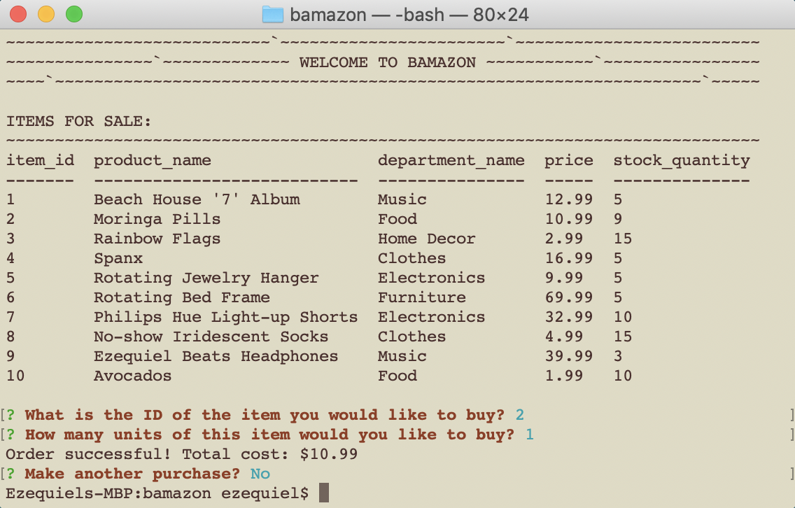

# bAmazon!
UT Austin Coding Bootcamp | Unit 12 mysql \
v1.0 \
Orig. Deployment - November 4, 2018

# Idea
Build an inventory and make a purchase as a customer!

# User Guide

Here's how it works:

- Open up Terminal / your CLI
- Make sure to download the appropriate node modules according to the package.json file
- Type `node bamazonCustomer.js` and hit Enter
- Follow the prompts
- Have fun!

The game uses basic concepts in node packages, modules, mysql and dotenv, so is good for a first run at mysql via node!

# Built Utilizing: 
dotenv \
inquirer \
node.js \ 
mysql

# Original Contributors:
Ezequiel Calderon (current edition and ongoing maintenance) - <https://github.com/playeasynow>

# Get Involved!
If you have any recommendations, let me know! Email: ezequiel.calderon.jr@gmail.com. If you'd like to take it in your own direction, go right ahead. 
